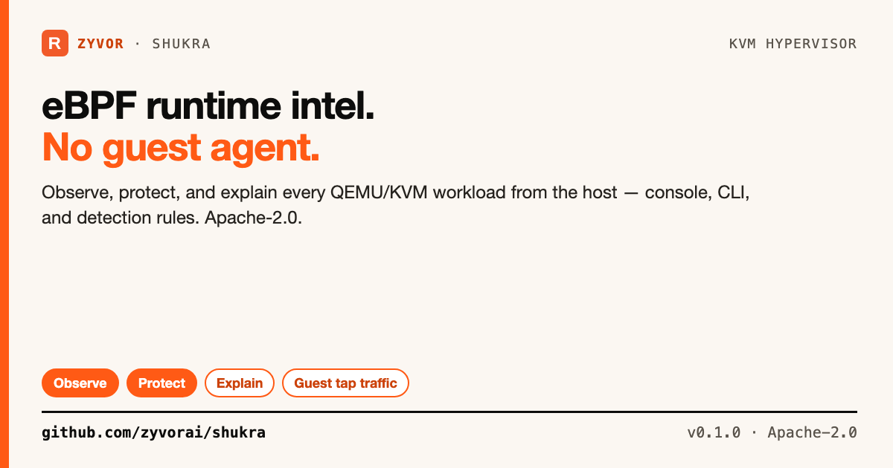

# Shukra

[](https://github.com/zyvorai/shukra/actions/workflows/ci.yml)
[](LICENSE)
[](CHANGELOG.md)

-informational)



**eBPF-powered runtime intelligence and security for KVM — Observe, Protect, Explain.**

📖 **[Product brochure (PDF)](docs/sales/brochure/Zyvor-Shukra-Product-Brochure.pdf)** · [Tutorials](docs/tutorials/README.md) · [API](docs/api.md) · [All docs](#documentation) · [Changelog](CHANGELOG.md)

Shukra sits on the hypervisor and watches every QEMU/KVM workload from outside the guest. There is no agent to install in the VM. The daemon attaches kernel traces, joins them to the QEMU process, and gives an operator a console and a CLI that say what they know, how they know it, and what they cannot see.

**8** eBPF programs · **35** kernel attach points · **0** agents in the guest · **17** console pages · **38** HTTP routes · **21** `shukractl` commands

<table>
  <tr>
    <td width="33%"><br><sub>Overview: what is attached, which VMs, what fired</sub></td>
    <td width="33%"><br><sub>Explain: ranked host-side causes with evidence</sub></td>
    <td width="33%"><br><sub>Contention: who took whose CPU</sub></td>
  </tr>
</table>

<sub>The screenshots are the console in fixture mode (`web/src/fixtures.ts`), not a live host. The [brochure](docs/sales/brochure/Zyvor-Shukra-Product-Brochure.pdf) walks a slow VM, a noisy neighbour, a past incident and lost traffic from start to finish.</sub>

| | |
|---|---|
| Daemon | `shukrad`: privileged, attaches traces, serves the API and console |
| CLI | `shukractl`: talks to the API only, never loads BPF |
| Console | `http://<hypervisor>:30970` |
| Module | `github.com/zyvorai/shukra` |
| License | [Apache-2.0](LICENSE) |

## Contents

- [What it answers](#what-it-answers)
- [What it does not do](#what-it-does-not-do)
- [The programs](#the-programs)
- [Features](#features)
- [Requirements](#requirements)
- [Quick start](#quick-start)
- [Deploy a hypervisor](#deploy-a-hypervisor)
- [Operator loop](#operator-loop)
- [Detection rules](#detection-rules)
- [Console](#console)
- [Monitor the daemon](#monitor-the-daemon)
- [What it costs](#what-it-costs)
- [Architecture](#architecture)
- [Documentation](#documentation)
- [Development](#development)
- [License](#license)

## What it answers

| The question | Ask | Guide |
|---|---|---|
| Why is this VM slow right now? | `shukractl explain <vm>`: ranked host-side causes over the last minute, with evidence and a list of what Shukra cannot see | [Tutorial 4](docs/tutorials/04-shukractl.md) |
| Why *was* it slow at 03:12, hours ago? | `shukractl explain <vm> --at 2026-09-20T03:12:00Z`, and `shukractl incident <vm> --at -3h --out bundle.json` | [Tutorial 9](docs/tutorials/09-after-the-fact.md) |
| Is the host, the disk or a noisy neighbour to blame? | `trace kvm`, `trace sched`, `trace block`: exit handling time, run-queue delay per vCPU thread, block latency histograms | [Signals](docs/signals.md) |
| Which VM is the noisy neighbour? | `trace contention`, and `explain` (`noisy_neighbour`, `cpu_preempted`) | [Signals](docs/signals.md#vcpu-preemption) |
| Is each VM the right size? | `shukractl advise` | [Signals](docs/signals.md#right-sizing) |
| What is new for this VM? | `shukractl baseline` | [Learned baselines](docs/baselines.md) |
| What is this VM connecting to, who connects to it, and what names does it look up or ask for? | `guest_connect`, `guest_flow`, `guest_inbound`, `guest_dns`, `guest_tls` events (`shukractl watch`, the Host connections page) | [Guest traffic](docs/tap.md) |
| Did the connection get an answer? | `trace tap`: accepted, refused, never answered or blocked, with the handshake time | [Lost traffic](docs/tutorials/08-lost-traffic.md) |
| Is something dropping this VM's traffic, or is it Shukra? | `trace drops` and `doctor` | [Where packets die](docs/drops.md) |
| Did the host's own network change under the VM? | `netlink_*` on `shukractl watch`; `tap-link-down`, `default-route-removed` and the other Netlink detections | [Netlink](docs/netlink.md) |
| Is a guest not reading its NIC? | `doctor` (`vm-nic-not-consumed`) and `explain` (`guest_not_reading_nic`) | [Doctor](docs/doctor.md) |
| Where may this VM connect to? | `shukractl policy` | [Egress policy](docs/egress-policy.md) |
| Is a VMM doing something a VMM never does? | Nothing to run: `vmm-sensitive-open` and `vmm-syscall` detections | [VMM tripwires](docs/vmm-tripwires.md) |
| Can it act on a detection, safely? | `responses:` in the rules file, `shukractl actions`, `approve`, `reject` | [Responses](docs/responses.md) |
| Can I cut a compromised VM off without touching it? | `shukractl isolate <vm>` | [Guest traffic and isolation](docs/tap.md#isolate) |
| Is Shukra itself set up safely? | `shukractl doctor`: exposure, what is attached, what it cannot see, each with a fix | [Doctor](docs/doctor.md) |

## What it does not do

Read this before you trust it with anything.

- **Host TCP is QEMU's, not the guest's.** `tcp_v4_connect` and `tcp_v6_connect` events are `attribution: "qemu-process"` and `guest_attributed: false`. Only events seen on a VM's tap are `guest_attributed: true`, and only for a tap that belongs to a VM in the current scan. A tap no VM owns stays unattributed. See [attribution](docs/attribution.md).
- **No agent, and no application data, with these exceptions.** Shukra never runs inside a guest and never reads what a guest says to the world. It reads four things beyond headers, and each has a switch:
  - the **name in a plain DNS query** over UDP port 53 (`-dns-events=false` turns it off);
  - the **first segment of a TLS ClientHello**, for its server name, protocols, version and a fingerprint. A ClientHello is sent before anything is encrypted and holds no application data (`-tls-events=false` makes the program read no TCP payload at all);
  - the **names of the files a QEMU process opens**, never their contents, and the first two numeric arguments of the few calls the `vmm` program watches (`-vmm-tripwires=false` does not load it);
  - process names (`comm`) of what a VMM starts and of a process that opens a file.

  Answers, the rest of a TLS connection, and everything else are not read. A name says what a VM is doing and a fingerprint says what software it runs, so they are treated as sensitive: see [Security](SECURITY.md). Shukra can say *which VM and which address*, not *which process inside the guest*. The guest's own CPU steal counter is not read; the host's view of the same thing, vCPU preemption and who caused it, is measured.
- **Isolation is real, and conditional.** `shukractl isolate` really drops the VM's tap traffic, but only with an explicit management allow list (`-isolate-allow`), and only on Linux 6.6 or newer (TCX). `applied` is `true` only after the kernel took the change. Without an allow list it is refused. On an older kernel the tap program stays detached and the host probes still run. Enforcement survives a daemon crash, restart or stop when `/sys/fs/bpf` is a bpf filesystem.
- **Nothing acts unless you turn it on.** Responses, egress policy and baselines are off until you configure or apply them. A response can only isolate a VM, and by default it only proposes. An egress policy judges what a guest *starts*, not what it answers, and is not a firewall. A baseline says a thing is *new*, never that it is bad.
- **The VMM tripwire is a tripwire, not a sandbox.** It reads a path when the call starts, does not follow symlinks, and does not see a VMM that does none of the things it watches for. See [what it does not see](docs/vmm-tripwires.md#what-it-does-not-see).
- **Advice is for a person.** Idleness is halt time, a lower bound, and only named on Intel hosts. `advise` never resizes anything.
- **A VM Shukra cannot see says so.** User-mode networking has no tap. A tap that is not in the host namespace, and that was not mapped to one, has no guest traffic, no drop counts and cannot be isolated. `shukractl doctor` names it. FluxVM's default per-VM netns is mapped to the host veth and is traced. See [FluxVM](docs/tap.md#fluxvm).
- **A program that is not measuring reports detached, with the reason.** A build without root, clang, or `/sys/kernel/btf/vmlinux` still serves discovered VMs. It never invents a counter, and a VM with no measurement has no series, not a zero.
- **Percentiles can read up to 2x high**, because they come from log2 buckets. See [What each program measures](docs/signals.md) for every caveat.
- **Past verdicts are coarse.** `explain --at` and `incident` read snapshots taken every 5 minutes, say how coarse the answer is, and say so when nothing is stored.
- **Tap: what is not built yet** is listed in [Tap: what is left](docs/roadmap-taptrace.md): VLAN tags and IPv6 extension headers, ICMP events, the guest's own memory, and which process inside the guest. Direct reclaim and OOM kills of the VMM, and block queue time, are measured.

PacketWolf and Zeus OS are the intended consumers of this JSON. They are not in this repository.

## The programs

Eight programs. Hot paths stay in maps. The ring buffer is only for discrete events, and the events a guest can cause are rate-limited on their own budgets. The host-side ones (`net` connects, and the `sched` and `block` slow-request thresholds) are bounded by the ring, not by a rate.

| Program | Hooks | What it records |
|---|---|---|
| `kvm` | `kvm_exit`, `kvm_entry`, `kvm_mmio`, `kvm_pio` | Exit counts by reason, exit handling time (histogram, halts excluded) and time per reason |
| `sched` | wakeup, switch, exec, exit | On-CPU time, run-queue delay (histogram, per thread), **vCPU preemption** (how long a vCPU was runnable but off a host CPU, and who had it), exec and exit events for QEMU children |
| `block` | `block_rq_insert`, `block_rq_issue`, `block_rq_complete` | Service-time and queue-time histograms, requests, bytes, errors and the slowest request, per direction |
| `net` | `tcp_v4_connect`, `tcp_v6_connect`, sampled `tcp_retransmit_skb` | Exact connect counts (IPv4 and IPv6) and 1-in-64 retransmit samples: **the QEMU process's** sockets |
| `mem` | `mm_vmscan_direct_reclaim_begin`, `mm_vmscan_direct_reclaim_end`, `oom/mark_victim` | Direct reclaim stalls and OOM kills of the VMM process, not the guest's own memory |
| `tap` | TCX ingress and egress on each VM tap (Linux 6.6+) | The guest's own traffic: per-tap counters; an event per TCP connect, per new UDP flow and per connection made *to* the guest; the name in each DNS query over UDP/53; the server name in each TLS ClientHello; what became of each TCP handshake (accepted, refused, never answered, blocked) and how long it took; isolation; and each VM's egress policy |
| `drops` | `skb:kfree_skb` on each VM tap (Linux 5.17+) | What the kernel dropped on the tap and why, by the kernel's own reason and the function that freed it, with Shukra's own isolation drops subtracted, so another program dropping a VM's traffic (Cilium, a dataplane, a `tc` filter) or a guest not reading its NIC is named |
| `vmm` | `openat`, `openat2`, `open`, `ptrace`, `process_vm_writev`, `process_vm_readv`, `mount`, `unshare`, `setns`, `init_module`, `finit_module`, `kexec_load`, `kexec_file_load` syscall tracepoints, plus `sched_process_fork` and `sched_process_exit` to follow descendants | For a QEMU process, and anything it started at any depth: the file it opened and the sensitive call it made, as events. A steady-state VMM does none |

That is 35 attach points in all: 4 + 4 + 3 + 3 + 3 + 2 + 1 + 15. `tap` is attached once per VM interface and comes and goes with the VMs.

Identity comes from the host: the QEMU command line (`-name` / `guest=`, `-uuid`, `ifname=`) and, for libvirt VMs whose taps are passed as file descriptors, the process's `fdinfo`. A FluxVM guest (QEMU, Cloud Hypervisor, Firecracker, or `fluxvm-hypervisor`) is named from FluxVM's `vms.json` instead, and its guest traffic is traced on the host interface, which for the default per-VM netns is the veth `vh<8hex>` rather than the tap inside that namespace. See [FluxVM](docs/tap.md#fluxvm). A PID that is not one of those VMM thread groups rolls up to `_host` as `unattributed`. It is never given a made-up VM name.

## Features

**Explain.** `shukractl explain <vm>` (and the Explain page) ranks the host-side causes of a slow VM over the last minute (`--window` 10s to 5m, or `lifetime`): host CPU contention (with `cpu_preempted` and `noisy_neighbour` when the scheduler names who took the CPU), storage latency, KVM exit handling, TCP retransmits, dropped guest traffic, a guest that is not reading its NIC, failing connects, or `no_host_cause`, which says the cause may be inside the guest. Every finding names its evidence, and `missing` lists what Shukra cannot see. See [tutorial 4](docs/tutorials/04-shukractl.md).

**Past verdicts and incident bundles.** The daemon stores a snapshot every 5 minutes under `-data-dir`. `explain <vm> --at <time>` (an RFC 3339 time, or `-3h`) is the verdict for a past moment, built with the same code as a live one, and says how coarse it is. `shukractl incident <vm> --at ... --out bundle.json` puts that verdict, the window's detections, the flight recorder, the VM's isolate requests, the allow list and the programs into one private file for a ticket. See [Investigate after the fact](docs/tutorials/09-after-the-fact.md) and [shukractl](docs/shukractl.md#past-verdicts-and-incident-bundles).

**Noisy-neighbour contention.** `trace contention` (and `explain`, `noisy_neighbour`) says who took whose CPU across VMs: for each victim, how much of its vCPU preemption one other VM, its own threads or a host task accounts for, and what that VM was doing meanwhile. See [What each program measures](docs/signals.md#vcpu-preemption).

**Right-sizing advisor.** `shukractl advise` looks at each VM's vCPUs over a window (1m to 5m): VMs with more vCPUs than they use (halt time, a lower bound, Intel hosts only), VMs that want CPU and are not getting it, nearly idle ones, and fine ones, each with the numbers, how sure it is, and its caveat. It is advice for a person, never an action. See [What each program measures](docs/signals.md#right-sizing).

**Learned baselines.** With a `baselines:` section in the rules file, each VM's normal networks (/24, /64), sites (registrable names, from DNS and TLS names) and inbound peers are learned over a per-VM period (24h by default), and the first sighting of a new one is reported once, guest-attributed, with no rule to write. Bounded against a guest: fixed-size sets and a daily cap. `shukractl baseline` shows where each VM stands. See [Learned baselines](docs/baselines.md).

**Guest traffic and TLS names.** The `tap` program sees what the guest sends on its own tap: connects, new UDP flows, connections made to it, DNS query names, and the server name (SNI), protocols, version, JA3 fingerprint and Encrypted Client Hello flag of each TLS ClientHello (`guest_tls`), so a site is named even when DNS was not used. It follows every TCP handshake to accepted, refused, never answered or blocked. `tls:` rules in the rules file match names like `dns:` rules do. See [Guest traffic and isolation](docs/tap.md) and [TLS server names](docs/tap.md#tls-server-names).

**Where packets die.** The `drops` program counts what the kernel dropped on each VM tap, by the kernel's own reason, and subtracts Shukra's own isolation drops, so a `tc` filter, Cilium or a guest not reading its NIC is named and Shukra is not blamed for what it did not do. See [Where packets die](docs/drops.md) and [Find out why traffic is lost](docs/tutorials/08-lost-traffic.md).

**Host network changes.** The daemon records link, address, route and neighbor changes from the kernel (`netlink_link`, `netlink_address`, `netlink_route`, `netlink_neighbor`), attributed `host-netlink`. A change on a VM's own tap names that VM; it does not claim the guest made it. A deleted VM tap, a tap that went down, a removed default route or a failed neighbor is a detection (`tap-link-deleted`, `tap-link-down`, `default-route-removed`, `neighbor-failed`, and the rest in the guide). `-netlink-events=false` stops the events and those detections; a link change still refreshes tap discovery. See [Netlink control-plane events](docs/netlink.md).

**Egress policy.** `shukractl policy` turns a VM's learned baseline into a list of networks it may *start* connections to. Learn a proposal, put the VM under it in **audit** mode (nothing is dropped; what would be is counted and reported), then **enforce** it with a timer that reverts it unless a person confirms. The management network can never be cut off, the kernel keeps enforcing without the daemon, and nothing changes for a VM until a policy is applied. See [Egress policy](docs/egress-policy.md).

**VMM tripwires.** The `vmm` program watches every QEMU process, and what it started, for the files it opens and for `ptrace`, `mount`, `unshare`, `setns` and module or kexec loads. A steady-state VMM does none of that, so any one is a detection (`vmm-sensitive-open`, `vmm-syscall`, `vmm-flood`), with nothing to configure. The `vmm:` section of the rules file adds paths, ignores some (a VM image kept under a watched directory) or narrows the calls. On by default; `-vmm-tripwires=false` does not load it. See [VMM tripwires](docs/vmm-tripwires.md).

**Guarded responses.** A `responses:` section lets a detection propose isolating a VM, which a person approves (`shukractl approve`, the Actions page), or, only for rules you name, do it on its own. Every response passes the guardrails: a protected list, a cooldown, an hourly cap, a proposal that lapses and a timed release. Each decision is recorded with the incident bundle it was made on. Off unless configured. See [Responses](docs/responses.md).

**Isolation.** `shukractl isolate <vm>` drops the VM's tap traffic except ARP, IPv6 neighbour discovery and your management allow list. It fails closed and survives the daemon. `applied` is true only after the kernel took the change. See [Guest traffic and isolation](docs/tap.md#isolate).

**Doctor.** `shukractl doctor` audits the daemon: who can call the API, what is attached, which VMs it cannot fully see, what is happening to their traffic, and how isolation, persistence, alerts and rules are set up, worst first and each with a fix. See [Doctor](docs/doctor.md).

## Requirements

| To get | You need |
|---|---|
| The daemon, CLI and API | Go 1.27+ to build (or a release tarball or `.deb`). Runs anywhere; programs are detached without BPF |
| The console | Node 22 to build it |
| `kvm`, `sched`, `block`, `net`, `vmm` | Linux with kernel BTF (`/sys/kernel/btf/vmlinux`), and `CAP_BPF` (5.8+) |
| `drops` | Linux 5.17+ (a drop reason on `kfree_skb`) |
| `tap`, guest traffic, egress policy and isolation | Linux 6.6+ (TCX), and `CAP_NET_ADMIN` |
| libvirt VMs' taps | `CAP_SYS_PTRACE` and `CAP_DAC_READ_SEARCH` |
| Building the programs | Linux with `clang` and `bpftool` |

A program the kernel cannot support reports itself `detached` with the reason, and the others still run. See [architecture](docs/architecture.md#kernel-requirements).

## Quick start

Go 1.27+ and Node 22 for the console.

```bash
make build
make web
./bin/shukrad -listen 127.0.0.1:30970 -web web/dist
./bin/shukractl status
```

If `SHUKRA_API_KEY` is unset, the daemon uses the dev token `shukra` and says so on stderr. Open `http://127.0.0.1:30970` and sign in with that token.

On a Mac, or any host without BTF, programs stay detached. VM discovery from `/proc` still works. To attach traces you need Linux, clang, bpftool and kernel BTF: see [Attach traces](docs/tutorials/02-attach-traces.md). To look at the console with no daemon at all, use fixture mode (see [Development](#development)); it is not live data.

## Deploy a hypervisor

Shukra is a systemd unit on the hypervisor, not a Helm chart. eBPF has to run where the VMs run.

```bash
./scripts/deploy-remote.sh 10.0.1.5 sus
```

That rsyncs the tree, builds the console and the CO-RE objects on the host, installs `shukrad` and `shukractl` to `/usr/local/bin`, and starts `shukra.service` on `127.0.0.1:30970`. The script checks the daemon on that address. A packaged install generates a random `SHUKRA_API_KEY` when the host has none; a binary you start yourself with the variable unset uses the dev token `shukra`. For a host without a compiler, `make dist` builds a tarball and a `.deb`, and `--prebuilt` deploys one. Keys and extra daemon flags go in `/etc/shukra/env` (`SHUKRA_API_KEY`, `SHUKRA_READONLY_KEY`, `SHUKRA_WEBHOOK_SECRET`, `SHUKRA_EXTRA_ARGS`). The unit reads its rules from `/etc/shukra/detections.yaml` and keeps state in `/var/lib/shukra`. Remote access needs TLS in front of loopback, or an explicit `-listen` plus `-tls-cert`/`-tls-key` or `-allow-insecure-http`. Full walkthrough: [Deploy a hypervisor](docs/tutorials/03-deploy.md).

## Operator loop

```bash
shukractl status                            # the one screen to trust first
shukractl doctor                            # what needs attention, worst first, each with a fix
shukractl programs                          # which programs are attached, and why one is not
shukractl vms                               # QEMU and FluxVM VMs found on the host
shukractl explain osboxes-debian            # the last minute; --window 5m or lifetime to change it
shukractl explain osboxes-debian --at -3h   # a past time, from stored 5-minute snapshots
shukractl incident osboxes-debian --at -3h --out bundle.json   # verdict, detections, events, isolations
shukractl trace kvm --vm osboxes-debian     # also sched, block, net, tap, drops, contention
shukractl trace tap --vm osboxes-debian     # the guest's traffic and what became of its connections
shukractl trace drops --vm osboxes-debian   # what the kernel dropped on its tap, and whether it was Shukra
shukractl trace contention                  # which VM took whose CPU
shukractl advise                            # over-provisioned or starved VMs, with the numbers
shukractl baseline                          # what each VM has learned as normal; --items for one VM's list
shukractl recorder osboxes-debian --window 60s
shukractl watch --json                      # stream events, resuming from the last one seen
shukractl security osboxes-debian           # rule hits for one VM
shukractl actions                           # proposals waiting for a person; approve <id> or reject <id>
shukractl policy learn osboxes-debian       # what its baseline says it may connect to
shukractl policy apply osboxes-debian --mode audit --from-baseline
shukractl isolate osboxes-debian            # needs -isolate-allow; prints whether it was applied
shukractl release osboxes-debian
shukractl rules check detections.yaml       # validate a rules file offline
```

`~/.shukra/env` is loaded when a variable is not already set. `SHUKRA_URL` defaults to `http://127.0.0.1:30970`. All 21 commands, flags and exit codes: [shukractl](docs/shukractl.md), or `shukractl help`.

```text
shukractl  →  HTTP  →  shukrad  →  tracepoints / kprobes / TCX on each VM tap
                              ↘  /proc QEMU scan
```

The CLI never attaches a program. The tap program pins its links and maps under `/sys/fs/bpf/shukra/tap`, so an isolation outlives the daemon: see [Guest traffic and isolation](docs/tap.md).

## Detection rules

One YAML file (`-watchlist`), re-read on `systemctl reload shukra`, validated with `shukractl rules check`. A bad file keeps the previous rules.

```yaml
destinations:                    # a watched network: a connect out to it, or a connection in from it
  - {cidr: 185.0.0.0/8, name: unexpected-egress, severity: high}
ports:
  - {port: 25, name: smtp-egress}                    # a connect the VM made (the default)
  - {port: 53, name: dns-out, proto: udp}            # tcp (default), udp or any
  - {port: 22, name: ssh-into-vm, dir: in}           # a connection made TO the VM
dns:                             # a name the guest looked up (UDP port 53): suffix, exact or contains
  - {name: crypto-pool, suffix: nanopool.org, severity: high}
tls:                             # a server name in a TLS ClientHello, matched the same way
  - {name: tor-front, suffix: torproject.org, severity: medium}
thresholds:                      # a per-VM metric over a window
  - {name: vm-traffic-dropped, metric: guest_drops_per_sec, value: 5, window: 30s}
  - {name: slow-disk, metric: block_write_p99_ms, value: 50}
exec_allow: [node_exporter]
baselines:                       # off unless present: what is new for each VM after it has been learned
  learn: 24h
vmm:                             # optional: the tripwires already work with no section
  ignore: [/root/images]
responses:                       # off unless present: propose isolating a VM, which a person approves
  - {name: contain-miners, rules: [crypto-pool], action: isolate, mode: propose}
guardrails:
  never_isolate: [db-primary]
suppress: 5m
```

A detection keeps the attribution of the event that caused it, so a rule that fires on something the guest did says the guest did it. Threshold metrics: `block_read_p99_ms`, `block_write_p99_ms`, `block_read_bytes_per_sec`, `block_write_bytes_per_sec`, `block_iops`, `wakeup_delay_ms`, `runqueue_delay_p99_ms`, `vcpu_preempted_ms_per_sec`, `kvm_exit_latency_p99_ms`, `kvm_exits_per_sec`, `tcp_retransmits_per_sec`, and, from the guest's tap, `guest_drops_per_sec`, `guest_connect_refused_per_sec`, `guest_connect_timeouts_per_sec` and `guest_inbound_per_sec`. A rule says nothing until a full window of history exists, and nothing for a VM whose measurement is not on.

See [Detection rules](docs/tutorials/06-watchlist.md), [Alert sinks](docs/tutorials/07-alert-sinks.md) (signed webhook, syslog, JSONL file), [Learned baselines](docs/baselines.md), [VMM tripwires](docs/vmm-tripwires.md) and [Responses](docs/responses.md) for each section.

## Console

`shukrad` serves the console on the API port. Sign in with the API key. Sixteen pages, in the same groups as the navigation:

| Group | Pages |
|---|---|
| Overview | Overview |
| Investigate | Virtual machines, Flight recorder, Explain (with an **At** field and an incident-bundle download) |
| Diagnostics | KVM, Scheduler, Contention, Right-size, Block, Programs |
| Network | Host connections (the QEMU process's connects, and the guest's own, with TLS names), Drops |
| Security | Detections, Actions (approve or reject a proposal), Egress policy, Isolate |

See [Console](docs/tutorials/05-console.md).

## Monitor the daemon

| Endpoint | Auth | |
|---|---|---|
| `GET /healthz` | none | Process is up |
| `GET /readyz` | none | `200` after the first scan, `503` before. Body has attached and total programs |
| `GET /metrics` | bearer | Prometheus text. A VM with no measured counters has no series, not a zero |
| `GET /api/v1/status`, `/vms`, `/programs` | bearer | The board, the VMs and their taps and threads, and the programs |
| `GET /api/v1/doctor` | bearer, read-only key is enough | The same audit as `shukractl doctor`. It never contains a key |
| `GET /api/v1/trace/{kvm,sched,block,net,tap,drops,contention}` | bearer | Per-VM counters. `contention` is who took whose CPU across VMs. An empty list is `[]`, never `null` |
| `GET /api/v1/explain?vm=<name>&window=<dur>&at=<time>` | bearer | Ranked findings for one VM. `window` is 10s to 5m, or `0`; the default is the last minute. With `at` it is a past time, from stored snapshots (`window` is then 5m to 6h) |
| `GET /api/v1/advice?vm=<name>&window=<dur>` | bearer | Is each VM the right size: idle and busy shares, preemption, run-queue wait, and the advice with evidence. `window` is 1m to 5m (default 5m) |
| `GET /api/v1/incident?vm=<name>&at=<time>&window=<dur>` | bearer | One bundle about a VM around a moment: verdict, detections, recorder events, isolate requests, allow list |
| `GET /api/v1/recorder?vm=<name>&window=<dur>` | bearer | The bounded per-VM flight recorder: default 60 s, at most 4096 events |
| `GET /api/v1/detections?vm=<name>` | bearer | Rule hits, capped like events |
| `GET /api/v1/security?vm=<name>` | bearer | Detections, whether isolation is enforced (`tcx` or `not_attached`), the allow list, and whether isolation survives the daemon |
| `GET /api/v1/baseline?vm=<name>&items=1` | bearer | What each VM has learned as normal, and where its learning stands |
| `GET /api/v1/policy`, `/policy/proposal?vm=<name>` | bearer | Each VM's [egress policy](docs/egress-policy.md) and what it has counted; what the baseline proposes |
| `GET /api/v1/actions?all=1`, `/actions/{id}/incident` | bearer | What [responses](docs/responses.md) decided, and the bundle each was made on |
| `GET /api/v1/export` | bearer | One document (status, VMs, traces, events) for a bug report |
| `GET /api/v1/events?since=<seq>` | bearer | Events newer than `seq`. Every event carries a `seq` that only grows |
| `GET /api/v1/stream` | bearer | Server-sent events. Resume with `Last-Event-ID` or `?since=` |
| `GET /api/v1/isolations` | bearer | Audit trail of isolate and release requests, and whether each took effect |
| `POST /api/v1/isolate`, `/release` | admin key | Isolate or release a VM. Refused without a management allow list |
| `POST /api/v1/policy/apply`, `/policy/confirm`, `/policy/remove` | admin key | Put a VM under an egress policy, keep an enforcing one, lift one |
| `POST /api/v1/actions/{id}/approve`, `/reject` | admin key | Decide a proposed isolation |
| `POST /api/v1/baseline/forget` | admin key | Start one VM's learning over. Recorded as a detection |

The whole surface, with fields, is in the [API reference](docs/api.md). Give Prometheus the **read-only** key (`SHUKRA_READONLY_KEY`): it can read everything and cannot isolate or change a policy. The API is plain HTTP unless you pass `-tls-cert` and `-tls-key`; `shukractl doctor` flags plain HTTP on a non-loopback address.

### Daemon flags

| Flag | Default | What it does |
|---|---|---|
| `-listen` | `127.0.0.1:30970` | API and console address |
| `-web` | `web/dist` | Console build to serve, if present |
| `-watchlist` | none | The rules file above |
| `-data-dir` | none | Keep detections, isolations, the recorder, policies, baselines and snapshots across restarts (below) |
| `-isolate-allow` | none | Comma-separated CIDRs an isolated VM can still reach. Without it, isolate, an enforcing policy and the action of any response are refused (a `dry_run` response is still recorded) |
| `-quarantine-uncovered` | `false` | Until an enforcing VM's saved policy is on a new tap, drop that tap except the management allow list. Off by default |
| `-dns-events` | `true` | Record the names a guest looks up. `false`: the program does not read DNS at all |
| `-tls-events` | `true` | Record the server names in a TLS ClientHello. `false`: the program does not read a TCP payload at all |
| `-vmm-tripwires` | `true` | Load the `vmm` program. `false`: it is not loaded |
| `-netlink-events` | `true` | Record host link, address, route and neighbor changes, and the detections made from them. `false`: those events and detections are not recorded; a link change still refreshes tap discovery |
| `-tls-cert`, `-tls-key` | none | Serve HTTPS (PEM). `SIGHUP` reloads the certificate. Required to listen off loopback unless `-allow-insecure-http` is set |
| `-allow-insecure-http` | `false` | Permit plain HTTP on a non-loopback address. The bearer key crosses the network in the clear |
| `-webhook-url`, `-syslog`, `-alert-file` | none | Alert sinks (webhook secret: `SHUKRA_WEBHOOK_SECRET`) |
| `-no-auth` | `false` | Serve the API without a key. `doctor` fails it |
| `-proc` | `/proc` | procfs root |
| `-detach-all` | | Remove every pinned tap program and its isolation, then exit. Works while the daemon is stopped |
| `-version` | | Print the version and exit |

The keys are environment variables, not flags: `SHUKRA_API_KEY` (admin) and `SHUKRA_READONLY_KEY`. The shipped unit puts them in `/etc/shukra/env`, mode `0600`, so `systemctl show` does not print them.

### Keep state across restarts

By default everything is in memory. `shukrad -data-dir /var/lib/shukra` (the systemd unit sets it) keeps:

| File | Written | Restored |
|---|---|---|
| `detections.jsonl` | on every detection | last 2048 |
| `isolations.jsonl` | on every isolate request | last 2048 |
| `recorder.json` | every minute and on clean shutdown | the per-VM flight recorder |
| `actions.jsonl`, `incidents/` | on every decision | what responses decided, and the incident bundle each was made on (empty until a response acts; the private directory is created either way) |
| `policies.json` | on every change | each VM's egress policy: its networks, its mode, and any timer waiting to be confirmed (only when a policy has been applied) |
| `baselines.json` | every minute, if it changed | what each VM has learned as normal (only when `baselines:` is on) |
| `snapshots.jsonl` | every 5 minutes | read on demand by `explain --at` and `incident`; not loaded into memory |

Counters and the event list are not saved: they are read from the kernel or rebuilt. After a crash the recorder can be up to a minute behind; detections and isolations are not. Each log rolls to `.1` at 16 MiB. The directory is `0700`, files `0600`, because they name your VMs and addresses.

## What it costs

Measured figures, each from the page that shows how it was taken. The first three were measured on the reference hypervisor (Intel Xeon E-2336, Linux 6.8), the daemon's on a 12-core production node running k3s and Cilium. Scale them by your own rates.

| What | Cost | Source |
|---|---|---|
| `vmm` program | about **183 ns** per `openat`, **0.161% of one core** at about 8,100 tracepoint hits a second; about 2% of a core at 100,000 opens a second. `-vmm-tripwires=false` if a host is that busy | [VMM tripwires](docs/vmm-tripwires.md#what-it-costs) |
| TLS server names in the `tap` program | about 10 to 15 ns added to a data segment, nothing to an ACK or a UDP datagram, about 60 to 85 ns for the one segment per connection that is a hello | [Guest traffic](docs/tap.md#what-it-costs) |
| Egress policy in the `tap` program | with no policy on a tap, one extra read and compare per packet: about 7 to 10 ns, about 1% of a core at a million packets a second | [Egress policy](docs/egress-policy.md#cost) |
| The daemon | after the daemon-cost fixes, 5 to 9% of a core and about 88 MB on a 12-core, 10-VM node, down from about 55% and 155 MB, with the same output | [Changelog](CHANGELOG.md) |

The cost of the other programs is in [What each program measures](docs/signals.md).

## Architecture

```text
┌──────────────────── hypervisor ────────────────────┐
│  VMM processes                 (guests untouched)  │
│      ▲ tap or host veth vh*                        │
│  kvm / sched / block / net / drops / vmm / tap     │  eBPF, CO-RE, maps + small rings
│              │                                     │
│           shukrad                                  │  identity, sampler, rules, responses, state, API
│         :30970 API                                 │
└──────────────┬─────────────────────────────────────┘
               │ bearer
       ┌───────┴────────┐
   shukractl         console
```

Events that leave the daemon carry `product: "shukra"`. A joined host event has `attribution: "qemu-process"` (this includes what a VMM or something it started opened or called), an event seen on a VM's tap has `attribution: "guest-tap"`, a host link, address, route or neighbor change has `attribution: "host-netlink"`, and an unowned PID has `attribution: "unattributed"`. How identity, the tap program, history windows and detection fit together is in [architecture](docs/architecture.md).

## Documentation

| Start here | |
|---|---|
| [Run it locally](docs/tutorials/01-run-locally.md) | Build, token, console, fixture mode |
| [Attach traces](docs/tutorials/02-attach-traces.md) | clang, BTF, `make generate`, `-tags shukrabpf` |
| [Deploy a hypervisor](docs/tutorials/03-deploy.md) | `deploy-remote.sh`, systemd, capabilities, TLS, packages |
| [Operator CLI](docs/tutorials/04-shukractl.md) | status, traces, explain, recorder, isolate |
| [Console](docs/tutorials/05-console.md) | Pages, the host banner, isolate |
| [Detection rules](docs/tutorials/06-watchlist.md) | Destinations, ports, thresholds, suppression |
| [Alert sinks](docs/tutorials/07-alert-sinks.md) | Signed webhook, syslog, JSONL file |
| [Find out why traffic is lost](docs/tutorials/08-lost-traffic.md) | Connection outcomes, kernel drops and Explain together |
| [Investigate after the fact](docs/tutorials/09-after-the-fact.md) | A verdict for a past time, who took the CPU, and an incident bundle for a ticket |
| [All tutorials](docs/tutorials/README.md) | The list, in order |

| Reference | |
|---|---|
| [API](docs/api.md) | Every route, parameter and field |
| [shukractl](docs/shukractl.md) | Commands, exit codes, scripting |
| [What each program measures](docs/signals.md) | Signals, caveats, every Prometheus series |
| [Attribution](docs/attribution.md) | Host events versus guest events, and what is not measured |
| [Guest traffic and isolation](docs/tap.md) | The tap program, handshakes, DNS and TLS names, isolate, durability, FluxVM |
| [Where packets die](docs/drops.md) | The drops program |
| [Netlink](docs/netlink.md) | Host link, address, route and neighbor changes |
| [Egress policy](docs/egress-policy.md) | Learn what a VM may connect to, audit it, then enforce it with a timer that reverts it |
| [Responses](docs/responses.md) | Acting on a detection: proposals, approval, and the guardrails |
| [VMM tripwires](docs/vmm-tripwires.md) | What a QEMU process should never do, and what the program that watches for it costs |
| [Learned baselines](docs/baselines.md) | What is new for a VM, with no rule to write |
| [Doctor](docs/doctor.md) | Every check, when it fires, and what to do |
| [Architecture](docs/architecture.md) | How the pieces fit, privileges, kernel requirements |
| [Testing](docs/testing.md) | Every test, where it can run, and what must never run on a live host |
| [Development](docs/development.md) | Build, conventions, adding a program |
| [Tap: what is left](docs/roadmap-taptrace.md) | What is not built yet |
| [Security](SECURITY.md) | What it reads, what it can do, what a hostile guest can do to it |
| [Changelog](CHANGELOG.md) | What changed |
| [Product brochure](docs/sales/brochure/Zyvor-Shukra-Product-Brochure.pdf) | Twenty-two pages for a buyer: the scenarios, right-sizing and baselines, the VMM tripwires, egress policy and responses, what each key and party can do, the measured costs, the limits, and a checklist. [Source and claims table](docs/sales/brochure/README.md) |

## Development

```bash
make test          # go test ./...
make web           # npm ci, unit tests, production build
make generate      # no-op without clang and /sys/kernel/btf/vmlinux
make test-bpf      # the tagged (shukrabpf) build and its tests (Linux, after make generate)
make test-kernel   # load the programs into this kernel and check the counters (root, Linux)
make test-tap      # guest traffic, isolation, drops, handshakes, egress policy and the VMM tripwires in a network namespace (root, Linux 6.6+)
make test-live-guest  # real KVM guests booted by fluxvm, seen by a running daemon (a hypervisor with fluxvm)
make dist          # release tarball and .deb for this architecture (Linux)
```

Default `go build` does not link CO-RE objects, so CI and macOS stay green. The Linux tag is `shukrabpf`. A missing KVM tracepoint detaches only the `kvm` program. Fixtures for tests live under `testdata/`.

| Where it is safe | Test |
|---|---|
| Anywhere, including a Mac | `make test`, `make web` |
| A Linux host, including a production hypervisor: the programs are private copies with their own maps | `make test-kernel`, `scripts/test-tap-progrun.sh` (the tap program's egress policy packet by packet), `scripts/bench-tap.sh` (per-packet cost), `make test-live-guest` |
| **Never a hypervisor already running Shukra** | `make test-tap` |

`make test-tap` shares the pin directory with the daemon and its cleanup removes every pinned tap link. [Testing](docs/testing.md) says what each test proves and how a BPF change is verified without a local Linux VM (write it, type-check the tagged build, deploy to a real host, let CI run the rig). [Development](docs/development.md) is the guide to the code.

### Continuous integration

| Workflow | Runs | What it proves |
|---|---|---|
| `CI` | every push and pull request | Go and console tests; race detector; vet; staticcheck; govulncheck; short fuzz; npm audit; coverage artifact; the tagged build; the programs loaded into the runner's kernel; the tap rig; the installer; the same Go and console tests on arm64 |
| `Live guest (fluxvm)` | weekly, by hand, and on changes to the tap code, the VMM tripwire code, identity code or the test | Two real KVM guests booted by fluxvm on a runner with `/dev/kvm`: the taps are attached as hot-plugs, guest events are attributed, one guest reaches the other, packet counts equal the kernel's, DNS and TLS names arrive as asked, an egress policy in audit mode marks exactly what is outside its list, a real QEMU is on the kernel's watched list, raises no tripwire detection while it runs, and raises a critical `vmm-sensitive-open` when asked over QMP to open `/etc/shadow`, and the taps come off when the VMs are deleted. It fails, rather than skips, on a runner with no KVM |
| `Release` | a `v*` tag | The tarball, `.deb`, container image and checksums for each architecture, a CycloneDX SBOM, and cosign signatures when `COSIGN_PRIVATE_KEY` is set |

### Fixture mode

```bash
cd web && VITE_FIXTURE=1 npm run dev
```

Fixture mode is a local console with no daemon. It is not live data.

### Brochure and social image

Both are generated, so they can be regenerated when the product changes.

```bash
python3 docs/sales/brochure/build.py --check   # the brochure PDF; fails if a page overflows
docs/sales/brochure/capture.sh                 # re-shoot the console pages from fixture mode
docs/social/build-social-card.sh               # docs/social/shukra-share-card.png and shukra-social-card.jpg
```

The brochure and the social card need Google Chrome (the card also needs macOS `sips`). Every number in the brochure has a source in [its claims table](docs/sales/brochure/README.md).

## License

Apache-2.0. Copyright 2026 Zyvor. See [LICENSE](LICENSE).
