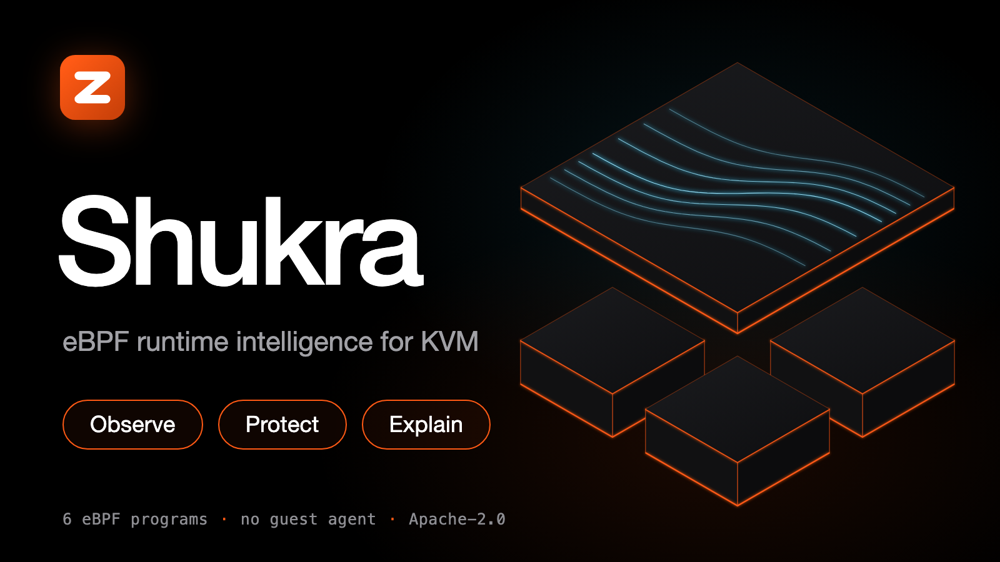
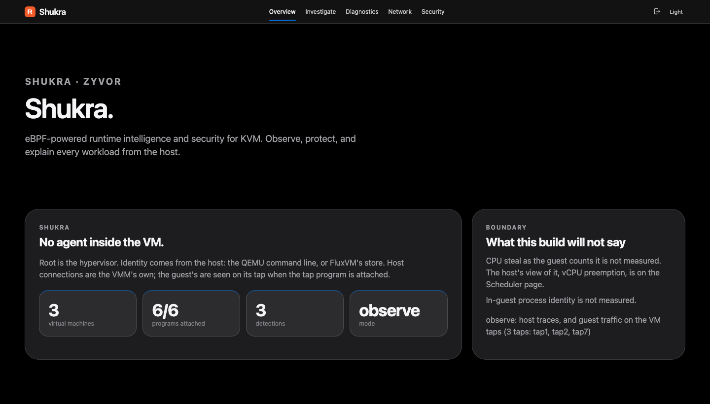
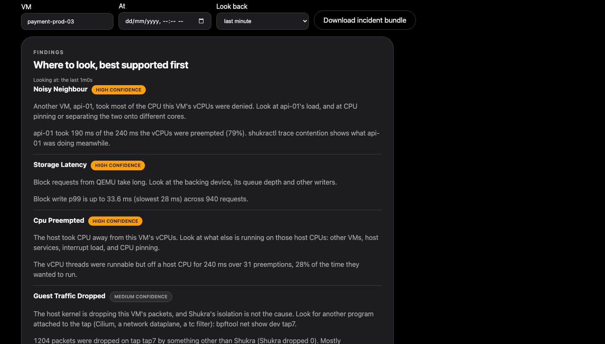
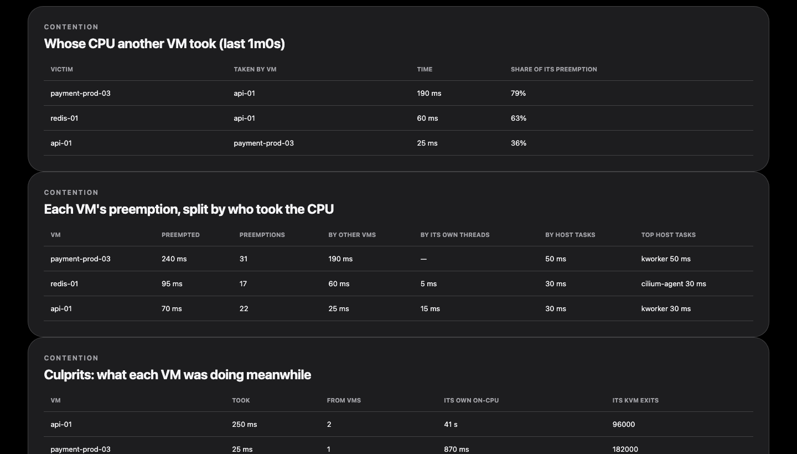

# Shukra

<p align="center">
  
</p>

<p align="center">
  <a href="LICENSE"></a>
  
  
  
</p>

<p align="center">
  <a href="docs/sales/brochure/Zyvor-Shukra-Product-Brochure.pdf"><b>Product brochure (PDF)</b></a> ·
  <a href="docs/tutorials/README.md">Tutorials</a> ·
  <a href="docs/api.md">API</a> ·
  <a href="CHANGELOG.md">Changelog</a>
</p>

**eBPF-powered runtime intelligence and security for KVM.**

Shukra sits on the hypervisor and watches every QEMU/KVM workload from outside the guest. There is no agent to install in the VM. The daemon attaches kernel traces, joins them to the QEMU process, and gives an operator a console and a CLI that say what they know, how they know it, and what they cannot see.

Observe. Protect. Explain.

**6** eBPF programs · **16** kernel attach points · **0** agents in the guest · **14** console pages · **28** HTTP routes · **17** `shukractl` commands

<table>
  <tr>
    <td width="33%"><br><sub>Overview: what is attached, which VMs, what fired</sub></td>
    <td width="33%"><br><sub>Explain: ranked host-side causes with evidence</sub></td>
    <td width="33%"><br><sub>Contention: who took whose CPU</sub></td>
  </tr>
</table>

<sub>The screenshots are the console in fixture mode (`web/src/fixtures.ts`), not a live host. The [brochure](docs/sales/brochure/Zyvor-Shukra-Product-Brochure.pdf) walks a slow VM, a noisy neighbour, a past incident and lost traffic from start to finish.</sub>

| | |
|---|---|
| Daemon | `shukrad`: privileged, attaches traces, serves the API and console |
| CLI | `shukractl`: talks to the API only, never loads BPF |
| Console | `http://<hypervisor>:30970` |
| Module | `github.com/zyvorai/shukra` |
| License | [Apache-2.0](LICENSE) |

## What it answers

| The question | Where the answer is |
|---|---|
| Why is this VM slow right now? | `shukractl explain <vm>`: ranked host-side causes over the last minute, with evidence and a list of what Shukra cannot see |
| Why *was* it slow at 03:12, hours ago? | `shukractl explain <vm> --at 2026-09-20T03:12:00Z`, and `shukractl incident <vm> --at -3h --out bundle.json`: a verdict and a bundle for a past time, from stored snapshots |
| Is the host, the disk or a noisy neighbour to blame? | `trace kvm`, `trace sched`, `trace block`: exit handling time, run-queue delay per vCPU thread, block latency histograms |
| Who took my vCPU's CPU? | `trace sched`, `explain` (`cpu_preempted`): how long the vCPUs were runnable but off a host CPU, and which VM or host process had it |
| Can it act on a detection, safely? | `responses:` in the rules file: a detection can propose isolating the VM, which a person approves (`shukractl approve`), or, only where you name the rules, do it on its own, with a protected list, a cooldown, an hourly cap and a timed release. Off unless configured |
| What is new for this VM? | `baselines:` in the rules file, then `shukractl baseline`: each VM's normal networks, sites and inbound peers are learned, and the first sighting of a new one is reported once. No rule to write; off unless you turn it on |
| Is each VM the right size? | `shukractl advise`: VMs with more vCPUs than they use (halt time, a lower bound) and VMs that want CPU and are not getting it, with the numbers and how sure it is. Advice for a person, never an action |
| Which VM is the noisy neighbour? | `trace contention`, `explain` (`noisy_neighbour`): who took whose CPU across VMs, how much of a VM's preemption one other VM accounts for, and what that VM was doing meanwhile |
| What is this VM connecting to, who connects to it, and what names does it look up? | `guest_connect`, `guest_flow`, `guest_inbound` and `guest_dns` events, seen on the VM's own tap |
| Did the connection get an answer? | `trace tap`: every TCP handshake ends as accepted, refused, never answered or blocked, with the handshake time |
| Is something dropping this VM's traffic, or is it Shukra? | `trace drops` and `doctor`: what the kernel dropped on the tap, by reason, with Shukra's own isolation subtracted |
| Is a guest not reading its NIC? | `doctor` (`vm-nic-not-consumed`) and `explain` (`guest_not_reading_nic`) |
| Can I cut a compromised VM off without touching it? | `shukractl isolate <vm>`: drops its tap traffic except your management network. It fails closed and survives the daemon |
| Is Shukra itself set up safely? | `shukractl doctor`: exposure, what is attached, what it cannot see, each with a fix |

## What you get

Six programs. Hot paths stay in maps. The ring buffer is only for discrete events, and every source of events is sampled or rate-limited.

| Program | Hooks | What it records |
|---|---|---|
| `kvm` | `kvm_exit`, `kvm_entry`, `kvm_mmio`, `kvm_pio` | Exit counts by reason, exit handling time (histogram, halts excluded) and time per reason |
| `sched` | wakeup, switch, exec, exit | On-CPU time, run-queue delay (histogram, per thread), **vCPU preemption** (how long a vCPU was runnable but off a host CPU, and who had it), exec and exit events for QEMU children |
| `block` | `block_rq_issue`, `block_rq_complete` | Latency histogram, requests, bytes and the slowest request, per direction |
| `net` | `tcp_v4_connect`, `tcp_v6_connect`, sampled `tcp_retransmit_skb` | Exact connect counts (IPv4 and IPv6) and 1-in-64 retransmit samples: **the QEMU process's** sockets |
| `tap` | TCX on each VM tap (Linux 6.6+) | The guest's own traffic: per-tap counters; an event per TCP connect, per new UDP flow and per connection made *to* the guest, and the name in each DNS query over UDP/53; what became of each TCP handshake (accepted, refused, never answered, blocked) and how long it took; and isolation |
| `drops` | `skb:kfree_skb` on each VM tap (Linux 5.17+) | What the kernel dropped on the tap and why, by the kernel's own reason and the function that freed it, with Shukra's own isolation drops subtracted, so another program dropping a VM's traffic (Cilium, a dataplane, a `tc` filter) or a guest not reading its NIC is named |

Percentiles come from log2 buckets and can read up to 2x high. See [What each program measures](docs/signals.md) for every caveat.

Identity comes from the host: the QEMU command line (`-name` / `guest=`, `-uuid`, `ifname=`) and, for libvirt VMs whose taps are passed as file descriptors, the process's `fdinfo`. A FluxVM guest (QEMU, Cloud Hypervisor, Firecracker, or `fluxvm-hypervisor`) is named from FluxVM's `vms.json` instead, and its guest traffic is traced on the host interface, which for the default per-VM netns is the veth `vh<8hex>` rather than the tap inside that namespace. See [FluxVM](docs/tap.md#fluxvm). A PID that is not one of those VMM thread groups rolls up to `_host` as `unattributed`. It is never given a made-up VM name.

## What this release will not pretend

- **Host TCP is QEMU's, not the guest's.** `tcp_v4_connect` and `tcp_v6_connect` events are `attribution: "qemu-process"` and `guest_attributed: false`. Only events seen on a VM's tap are `guest_attributed: true`, and only for a tap that belongs to a VM in the current scan. A tap no VM owns stays unattributed. See [attribution](docs/attribution.md).
- **No agent, no payloads.** Shukra never runs inside a guest and never reads application data. The one thing it reads beyond headers is the name in a plain DNS query over UDP port 53 (`-dns-events=false` turns that off); answers, DNS over TCP, TLS or HTTPS, and everything else are not read. It can say *which VM and which address*, not *which process inside the guest*. The guest's own CPU steal counter is not read; the host's view of the same thing, vCPU preemption and who caused it, is measured.
- **Isolation is real, and conditional.** `shukractl isolate` really drops the VM's tap traffic, but only with an explicit management allow list (`-isolate-allow`), only on Linux 6.6 or newer, and `applied` is `true` only after the kernel took the change. Without an allow list it is refused. Enforcement survives a daemon crash, restart or stop when `/sys/fs/bpf` is a bpf filesystem.
- **A VM Shukra cannot see says so.** User-mode networking has no tap. A tap that is not in the host namespace, and that was not mapped to one, has no guest traffic, no drop counts and cannot be isolated. `shukractl doctor` names it. FluxVM's default per-VM netns is mapped to the host veth and is traced. See [FluxVM](docs/tap.md#fluxvm).
- **A program that is not measuring reports detached, with the reason.** A build without root, clang, or `/sys/kernel/btf/vmlinux` still serves discovered VMs. It never invents a counter, and a VM with no measurement has no series, not a zero.

PacketWolf and Zeus OS are the intended consumers of this JSON. They are not in this repository.

## Requirements

| To get | You need |
|---|---|
| The daemon, CLI and API | Go 1.25+ to build (or a release tarball or `.deb`). Runs anywhere; programs are detached without BPF |
| The console | Node 22 to build it |
| `kvm`, `sched`, `block`, `net` | Linux with kernel BTF (`/sys/kernel/btf/vmlinux`), and `CAP_BPF` (5.8+) |
| `drops` | Linux 5.17+ (a drop reason on `kfree_skb`) |
| `tap`, guest traffic and isolation | Linux 6.6+ (TCX), and `CAP_NET_ADMIN` |
| libvirt VMs' taps | `CAP_SYS_PTRACE` and `CAP_DAC_READ_SEARCH` |
| Building the programs | Linux with `clang` and `bpftool` |

A program the kernel cannot support reports itself `detached` with the reason, and the others still run. See [architecture](docs/architecture.md#kernel-requirements).

## Quick start

Go 1.25+ and Node 22 for the console.

```bash
make build
make web
./bin/shukrad -listen 127.0.0.1:30970 -web web/dist
./bin/shukractl status
```

If `SHUKRA_API_KEY` is unset, the daemon uses the dev token `shukra` and says so on stderr. Open the console and sign in with that token.

On a Mac, or any host without BTF, programs stay detached. VM discovery from `/proc` still works. To attach traces you need Linux, clang, bpftool and kernel BTF: see [Attach traces](docs/tutorials/02-attach-traces.md).

## Deploy a hypervisor

Shukra is a systemd unit on the hypervisor, not a Helm chart. eBPF has to run where the VMs run.

```bash
./scripts/deploy-remote.sh 10.0.1.5 sus
```

That rsyncs the tree, builds the console and the CO-RE objects on the host, installs `shukrad` and `shukractl` to `/usr/local/bin`, starts `shukra.service` on `0.0.0.0:30970`, waits for it to answer, and prints `status`, `programs`, `vms` and `doctor`. Set a real key on any host that is not a lab (`SHUKRA_API_KEY=$(openssl rand -hex 16)`). For a host without a compiler, `make dist` builds a tarball and a `.deb`. Full walkthrough: [Deploy a hypervisor](docs/tutorials/03-deploy.md).

## Operator loop

```bash
shukractl status                            # the one screen to trust first
shukractl doctor                            # what needs attention, worst first, each with a fix
shukractl programs                          # which programs are attached, and why one is not
shukractl vms                               # QEMU VMs found on the host
shukractl explain osboxes-debian            # the last minute; --window 5m or lifetime to change it
shukractl trace kvm --vm osboxes-debian     # also sched, block, net, tap, drops, contention
shukractl trace tap --vm osboxes-debian     # the guest's traffic and what became of its connections
shukractl trace drops --vm osboxes-debian   # what the kernel dropped on its tap, and whether it was Shukra
shukractl recorder osboxes-debian --window 60s
shukractl advise                            # over-provisioned or starved VMs, with the numbers
shukractl explain osboxes-debian --at -3h   # a past time, from stored 5-minute snapshots
shukractl incident osboxes-debian --at -3h --out bundle.json   # verdict, detections, events, isolations
shukractl watch --json                      # stream events, resuming from the last one seen
shukractl security osboxes-debian           # rule hits for one VM
shukractl isolate osboxes-debian            # needs -isolate-allow; prints whether it was applied
shukractl release osboxes-debian
shukractl rules check detections.yaml       # validate a rules file offline
```

`~/.shukra/env` is loaded when a variable is not already set. `SHUKRA_URL` defaults to `http://127.0.0.1:30970`. Reference: [shukractl](docs/shukractl.md).

```text
shukractl  →  HTTP  →  shukrad  →  tracepoints / kprobes / TCX on each VM tap
                              ↘  /proc QEMU scan
```

The CLI never attaches a program. The tap program pins its links and maps under `/sys/fs/bpf/shukra/tap`, so an isolation outlives the daemon: see [Guest traffic and isolation](docs/tap.md).

## Detection rules

One YAML file (`-watchlist`), re-read on `systemctl reload shukra`, validated with `shukractl rules check`. A bad file keeps the previous rules.

```yaml
destinations:                    # a watched network: a connect out to it, or a connection in from it
  - {cidr: 185.0.0.0/8, name: unexpected-egress, severity: high}
ports:
  - {port: 25, name: smtp-egress}                    # a connect the VM made (the default)
  - {port: 53, name: dns-out, proto: udp}            # tcp (default), udp or any
  - {port: 22, name: ssh-into-vm, dir: in}           # a connection made TO the VM
dns:                             # a name the guest looked up (UDP port 53): suffix, exact or contains
  - {name: crypto-pool, suffix: nanopool.org, severity: high}
thresholds:                      # a per-VM metric over a window
  - {name: vm-traffic-dropped, metric: guest_drops_per_sec, value: 5, window: 30s}
  - {name: slow-disk, metric: block_write_p99_ms, value: 50}
exec_allow: [node_exporter]
baselines:                       # off unless present: what is new for each VM after it has been learned
  learn: 24h
suppress: 5m
```

A detection keeps the attribution of the event that caused it, so a rule that fires on something the guest did says the guest did it. Metrics: `block_read_p99_ms`, `block_write_p99_ms`, `wakeup_delay_ms`, `runqueue_delay_p99_ms`, `vcpu_preempted_ms_per_sec`, `kvm_exit_latency_p99_ms`, `kvm_exits_per_sec`, `tcp_retransmits_per_sec`, the block throughput metrics, and, from the guest's tap, `guest_drops_per_sec`, `guest_connect_refused_per_sec`, `guest_connect_timeouts_per_sec` and `guest_inbound_per_sec`. A rule says nothing until a full window of history exists, and nothing for a VM whose measurement is not on. See [Detection rules](docs/tutorials/06-watchlist.md) and [Alert sinks](docs/tutorials/07-alert-sinks.md) (signed webhook, syslog, JSONL file).

## Monitor the daemon

| Endpoint | Auth | |
|---|---|---|
| `GET /healthz` | none | Process is up |
| `GET /readyz` | none | `200` after the first scan, `503` before. Body has attached and total programs |
| `GET /metrics` | bearer | Prometheus text. A VM with no measured counters has no series, not a zero |
| `GET /api/v1/status`, `/vms`, `/programs` | bearer | The board, the VMs and their taps and threads, and the programs |
| `GET /api/v1/doctor` | bearer, read-only key is enough | The same audit as `shukractl doctor`. It never contains a key |
| `GET /api/v1/trace/{kvm,sched,block,net,tap,drops,contention}` | bearer | Per-VM counters. `contention` is who took whose CPU across VMs. An empty list is `[]`, never `null` |
| `GET /api/v1/explain?vm=<name>&window=<dur>&at=<time>` | bearer | Ranked findings for one VM. `window` is 10s to 5m, or `0`; the default is the last minute. With `at` it is a past time, from stored snapshots (`window` is then 5m to 6h) |
| `GET /api/v1/advice?vm=<name>&window=<dur>` | bearer | Is each VM the right size: idle and busy shares, preemption, run-queue wait, and the advice with evidence. `window` is 1m to 5m (default 5m) |
| `GET /api/v1/incident?vm=<name>&at=<time>&window=<dur>` | bearer | One bundle about a VM around a moment: verdict, detections, recorder events, isolate requests, allow list |
| `GET /api/v1/recorder?vm=<name>&window=<dur>` | bearer | The bounded per-VM flight recorder: default 60 s, at most 4096 events |
| `GET /api/v1/detections?vm=<name>` | bearer | Rule hits, capped like events |
| `GET /api/v1/security?vm=<name>` | bearer | Detections, whether isolation is enforced (`tcx` or `not_attached`), the allow list, and whether isolation survives the daemon |
| `GET /api/v1/export` | bearer | One document (status, VMs, traces, events) for a bug report |
| `GET /api/v1/events?since=<seq>` | bearer | Events newer than `seq`. Every event carries a `seq` that only grows |
| `GET /api/v1/stream` | bearer | Server-sent events. Resume with `Last-Event-ID` or `?since=` |
| `GET /api/v1/isolations` | bearer | Audit trail of isolate and release requests, and whether each took effect |
| `POST /api/v1/isolate`, `POST /api/v1/release` | admin key | Isolate or release a VM. Refused without a management allow list |

The whole surface, with fields, is in the [API reference](docs/api.md). Give Prometheus the **read-only** key (`SHUKRA_READONLY_KEY`): it can read everything and cannot isolate. The API is plain HTTP unless you pass `-tls-cert` and `-tls-key`; `shukractl doctor` flags plain HTTP on a non-loopback address.

### Keep state across restarts

By default everything is in memory. `shukrad -data-dir /var/lib/shukra` (the systemd unit sets it) keeps:

| File | Written | Restored |
|---|---|---|
| `detections.jsonl` | on every detection | last 2048 |
| `isolations.jsonl` | on every isolate request | last 2048 |
| `recorder.json` | every minute and on clean shutdown | the per-VM flight recorder |
| `actions.jsonl`, `incidents/` | on every decision | what responses decided, and the incident bundle each was made on (empty until a response acts; the private directory is created either way) |
| `baselines.json` | every minute, if it changed | what each VM has learned as normal (only when `baselines:` is on) |
| `snapshots.jsonl` | every 5 minutes | read on demand by `explain --at` and `incident`; not loaded into memory |

Counters and the event list are not saved: they are read from the kernel or rebuilt. After a crash the recorder can be up to a minute behind; detections and isolations are not. Each log rolls to `.1` at 16 MiB. The directory is `0700`, files `0600`, because they name your VMs and addresses.

## Architecture

```text
┌──────────────── hypervisor ────────────────┐
│  VMM processes          (guests untouched) │
│      ▲ tap or host veth vh*                │
│  kvm / sched / block / net / drops / tap   │  eBPF, CO-RE, maps + a small ring
│              │                             │
│           shukrad                          │  identity, sampler, rules, state, API
│         :30970 API                         │
└──────────────┬─────────────────────────────┘
               │ bearer
       ┌───────┴────────┐
   shukractl         console
```

Events that leave the daemon carry `product: "shukra"`. A joined host event has `attribution: "qemu-process"`, an event seen on a VM's tap has `attribution: "guest-tap"`, and an unowned PID has `attribution: "unattributed"`. How identity, the tap program, history windows and detection fit together is in [architecture](docs/architecture.md).

## Documentation

| Start here | |
|---|---|
| [Run it locally](docs/tutorials/01-run-locally.md) | Build, token, console, fixture mode |
| [Attach traces](docs/tutorials/02-attach-traces.md) | clang, BTF, `make generate`, `-tags shukrabpf` |
| [Deploy a hypervisor](docs/tutorials/03-deploy.md) | `deploy-remote.sh`, systemd, capabilities, TLS, packages |
| [Operator CLI](docs/tutorials/04-shukractl.md) | status, traces, explain, recorder, isolate |
| [Console](docs/tutorials/05-console.md) | Pages, the host banner, isolate |
| [Detection rules](docs/tutorials/06-watchlist.md) | Destinations, ports, thresholds, suppression |
| [Alert sinks](docs/tutorials/07-alert-sinks.md) | Signed webhook, syslog, JSONL file |
| [Find out why traffic is lost](docs/tutorials/08-lost-traffic.md) | Connection outcomes, kernel drops and Explain together |
| [Investigate after the fact](docs/tutorials/09-after-the-fact.md) | A verdict for a past time, who took the CPU, and an incident bundle for a ticket |

| Reference | |
|---|---|
| [API](docs/api.md) | Every route, parameter and field |
| [shukractl](docs/shukractl.md) | Commands, exit codes, scripting |
| [What each program measures](docs/signals.md) | Signals, caveats, every Prometheus series |
| [Attribution](docs/attribution.md) | Host events versus guest events, and what is not measured |
| [Guest traffic and isolation](docs/tap.md) | The tap program, handshakes, isolate, durability |
| [Where packets die](docs/drops.md) | The drops program |
| [Responses](docs/responses.md) | Acting on a detection: proposals, approval, and the guardrails |
| [Learned baselines](docs/baselines.md) | What is new for a VM, with no rule to write |
| [Doctor](docs/doctor.md) | Every check, when it fires, and what to do |
| [Architecture](docs/architecture.md) | How the pieces fit, privileges, kernel requirements |
| [Testing](docs/testing.md) | Every test, where it can run, and what must never run on a live host |
| [Development](docs/development.md) | Build, conventions, adding a program |
| [Tap: what is left](docs/roadmap-taptrace.md) | What is not built yet |
| [Security](SECURITY.md) | What it reads, what it can do, what a hostile guest can do to it |
| [Changelog](CHANGELOG.md) | What changed |
| [Product brochure](docs/sales/brochure/Zyvor-Shukra-Product-Brochure.pdf) | Sixteen pages for a buyer: the scenarios, right-sizing and baselines, the limits, and a checklist. [Source and claims table](docs/sales/brochure/README.md) |

## Development

```bash
make test          # go test ./...
make web           # npm ci, unit tests, production build
make generate      # no-op without clang and /sys/kernel/btf/vmlinux
make test-kernel   # load the programs into this kernel and check the counters (root, Linux)
make test-tap      # guest traffic, isolation, drops and handshakes in a network namespace (root, Linux 6.6+)
make test-live-guest  # real KVM guests booted by fluxvm, seen by a running daemon (a hypervisor with fluxvm)
make dist          # release tarball and .deb for this architecture (Linux)
```

Default `go build` does not link CO-RE objects, so CI and macOS stay green. The Linux tag is `shukrabpf`. A missing KVM tracepoint detaches only the `kvm` program. Fixtures for tests live under `testdata/`.

**`make test-tap` must not run on a hypervisor that is already running Shukra**: it shares the pin directory with the daemon and its cleanup removes every pinned tap link. The live guest test is the one that is safe there. [Testing](docs/testing.md) says what each test proves and how a BPF change is verified without a local Linux VM (write it, type-check the tagged build, deploy to a real host, let CI run the rig).

### Continuous integration

| Workflow | Runs | What it proves |
|---|---|---|
| `CI` | every push and pull request | Go and console tests, the programs loaded into the runner's kernel, the tap rig (guest traffic, isolation, drops and every handshake outcome, with exact counts), the installer |
| `Live guest (fluxvm)` | weekly, by hand, and on changes to the tap code, identity code or the test | Two real KVM guests booted by fluxvm on a runner with `/dev/kvm`: the taps are attached as hot-plugs, guest events are attributed, one guest reaches the other, packet counts equal the kernel's, and the taps come off when the VMs are deleted. It fails, rather than skips, on a runner with no KVM |
| `Release` | a `v*` tag | The tarball and `.deb` for each architecture |

```bash
cd web && VITE_FIXTURE=1 npm run dev
```

Fixture mode is a local console with no daemon. It is not live data.

### Brochure and social image

Both are generated, so they can be regenerated when the product changes.

```bash
python3 docs/sales/brochure/build.py --check   # the brochure PDF; fails if a page overflows
docs/sales/brochure/capture.sh                 # re-shoot the console pages from fixture mode
docs/social/build-social-card.sh               # docs/shukra-social.png and web/public/og.png, byte-identical
```

The brochure and the social card need Google Chrome (the card also needs macOS `sips`). Every number in the brochure has a source in [its claims table](docs/sales/brochure/README.md).

## License

Apache-2.0. Copyright 2026 Zyvor. See [LICENSE](LICENSE).
